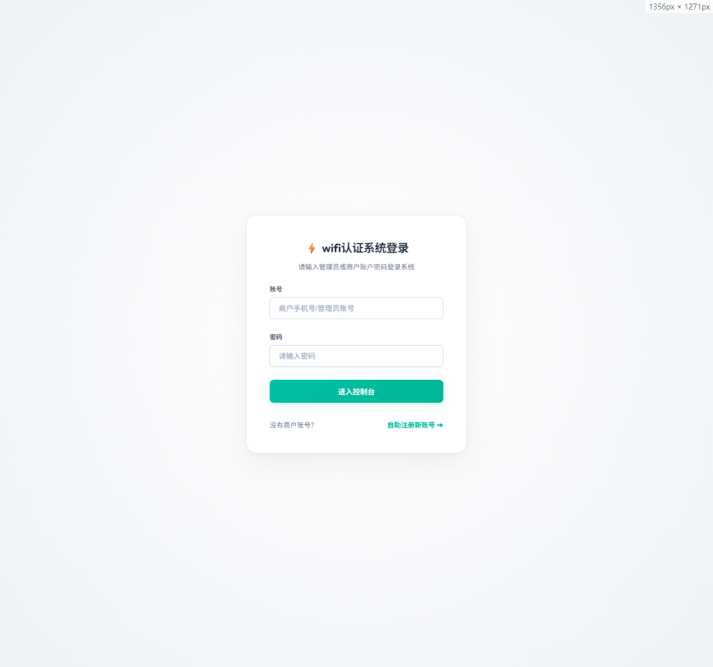
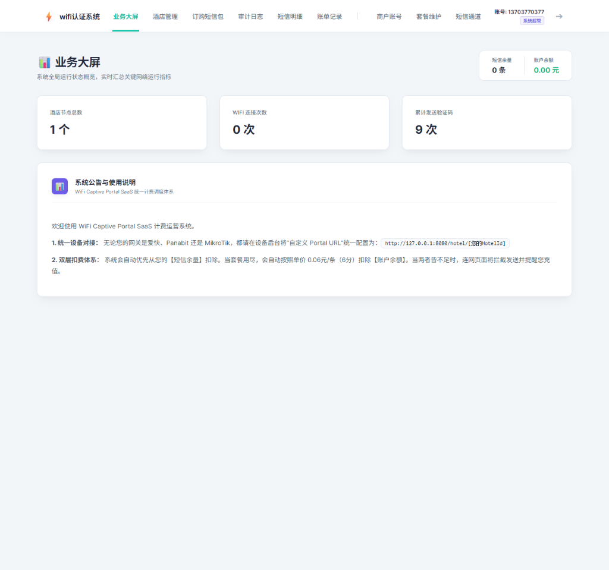
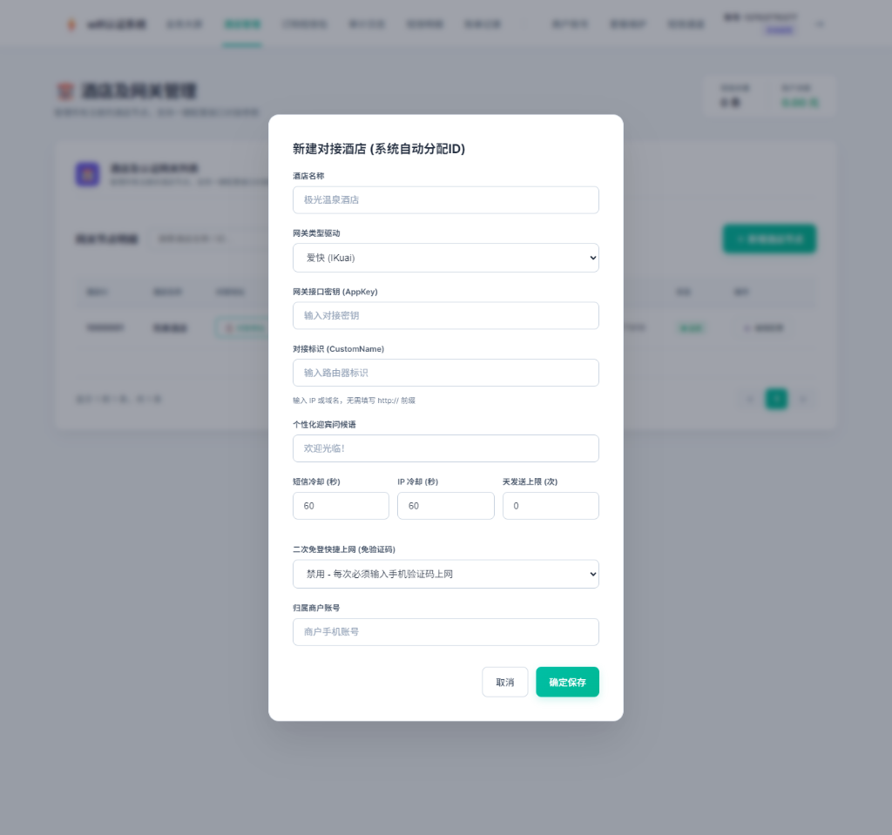
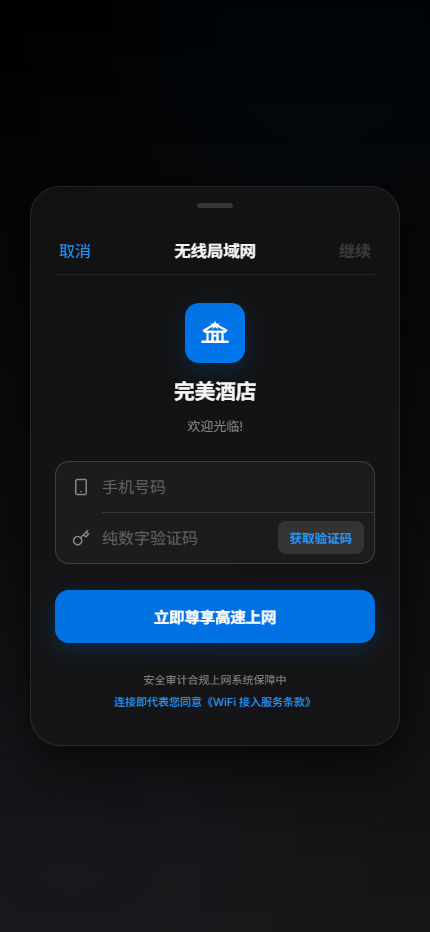
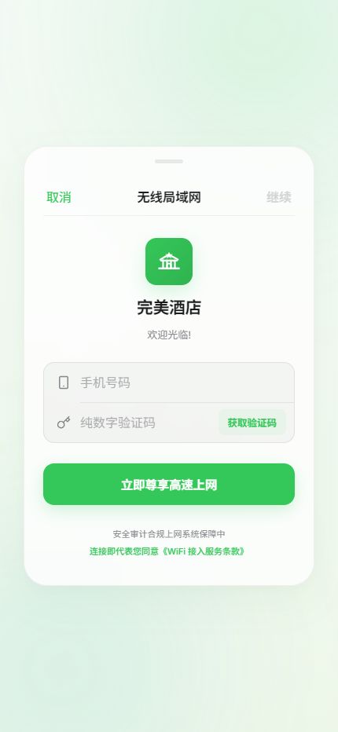

# ⚡ WiFi Captive Portal SaaS 计费运营系统 (Wifi-Portal)

本系统是一个基于 **Go (Golang) + MongoDB + Redis** 开发的高可用、高性能商业级多商户 WiFi 热点短信认证 Portal SaaS 平台。支持对接 **爱快 (iKuai)、Panabit、MikroTik** 等主流网络硬件网关，并配备了双层短信计费引擎、多短信通道加权调度与一键级联销户数据清理机制。

---

## 🎨 核心界面展示

### 1. 现代苹果风系统登录与自助商户注册

采用高斯模糊（Glassmorphism）与微动画反馈的登录界面，支持短信验证码免密注册与账户自激活。



### 2. 商户业务大屏 (Dashboard)

实时汇总展现酒店节点总数、WiFi 连网放行次数与累计发送验证码指标，配备详细的设备对接引导与计费透明说明。



### 3. 酒店及认证网关极简配置

支持图形化创建、修改对接酒店，参数直观配置。全新升级的**二次免登快捷上网（免验证码认证）**功能与短信冷却、天发送上限等参数直接落库控制，彻底摆脱静态配置文件束缚。



### 4. 访客连网授权认证页面 (手机端 Captive Portal)

自适应弹出式连网认证页面，支持中国大陆 11 位手机号快速获取验证码，支持免登快捷连网，界面极致简约优美。

| 明亮模式 | 暗黑模式 |
| :---: | :---: |
|  |  |

---

## 🚀 核心技术与商业特性

* **多通道加权高可用**：原生集成 **阿里云短信 (Aliyun)**、**腾讯云短信 (Tencent)**、**互亿无线 (Ihuyi)**、**短信精灵 (SmsJingling)** 与 **本地模拟 (Mock)** 五大短信提供商。支持后台 1-10 阶梯式发送权重分配，实现多通道高容灾负载均衡与分流。
* **实时通道余量查询**：支持超级管理员在后台一键安全地查询**短信精灵**、**互亿无线**及**模拟通道**的实时短信余额，极简交互、数据透明，具备完善的防爆防挂鉴权保护。
* **双层短信扣费引擎**：优先扣减商户拥有的【短信套餐包】剩余条数，套餐消耗殆尽后自动无缝切换至扣除【账户余额】。余额不足时提供优雅的页面拦截提示。
* **物理级联销户 (Cascading Delete)**：支持超管一键安全物理删除商户主体，自动触发净化链条，级联抹除其名下全部酒店、上网审计日志 (`auth_logs`)、短信流水账单 (`sms_logs`)、充值购买流水 (`recharge`)。同时，**秒级注销被删商户在 Redis 中的所有活跃 Token**，保障极速安全下线。
* **酒店配置及审计日志级联删除**：商户与超管可在后台一键删除特定酒店网关配置，**同步级联物理清理该酒店产生的所有访客上网审计日志 (`auth_logs`)**，保持数据库数据净化度。接口搭载严格的多租户水平权限防越权鉴权锁。
* **全网财务账单对账大盘**：全新的充值与对账记录模块。商户端可追踪历史消费，**超级管理员（Level >= 50）可一键拉取并实时展示全网最新 200 条充值与财务对账流水**，提供全网统一的高可靠 ULID 对账大盘，防 `null` 空值崩溃设计。
* **首页静默化与隐藏后台挂载 (/manage)**：首页 `/` 彻底实现完全静默化零响应。彻底废弃并屏蔽了外界常用的 `/admin` 后台登录路径扫描，升级为全新隐藏入口 **/manage**，极大提高了平台的防扫描安全防线。
* **苹果级 Captive Portal 上网认证**：访客终端连接 WiFi 时自适应弹出明亮/深色模式认证页，完美兼容 iOS / Android 原生弹窗，并提供手机号本地存储免验证码免密重连。
* **守护进程及命令行服务管理**：针对 Linux 环境原生内置完备的服务子命令（`start [-d]`、`stop`、`restart`、`status`、`log`），启动服务支持以 `-d` 模式在后台静默运行并**自动将标准日志重定向输出至同级 `wifi.log` 中**。

---

## 📂 模块目录结构

```text
tools/ikuai-portal/
├── main.go               # 系统主程序入口与 -d 守护进程初始化
├── auth.go               # 基于 Session 的高并发登录态校验与权限中间件
├── database.go           # MongoDB 数据库驱动、索引检查与种子数据自动初始化
├── session.go            # Redis 短信频次限流、冷却控制与全局活跃会话管理器
├── sms.go                # 双层扣费原子交易控制与多通道加权调度发送引擎
├── handler_admin.go      # 超管/商户资料维护、注资充值、物理级联销户 API 控制器
├── handler_portal.go     # 网关重定向放行、OTP 验证码校验、快捷免认证 API 控制器
├── config.go             # YAML 配置文件高扩展解析器
├── config.yaml           # 本地数据库、Redis 与全局短信冷却参数配置文件
├── Dockerfile            # [NEW] 多阶段容器镜像构建文件
├── docker-compose.yaml   # [NEW] 容器化一键编排部署方案 (包含 App + MongoDB + Redis)
├── config.docker.yaml    # [NEW] 专门适配 Docker 虚拟网络及凭证的安全配置文件
├── images/               # 核心功能界面高清截图目录
└── web/                  # 静态资源前端包
    ├── admin/            # 苹果风格 SaaS 商户控制台与超管运营后台
    └── portal/           # 访客 Captive Portal 原生连网适配页面
```

---

## 🛠️ 快速部署与运行

### 1. 前置环境要求

* **MongoDB**：用于存储系统持久化账户、酒店节点、财务及连网日志（支持单机或副本集）。
* **Redis**：用于存储高并发会话 Token、OTP 短信冷却频次记录与临时验证码。

### 2. 配置文件说明

系统运行时若检测到本地目录缺失 `config.yaml`，将**自动以正确的结构释放默认配置文件**。您也可以手动将 `config.yaml.example` 复制为 `config.yaml` 进行自定义修改。正确的配置结构如下：

```yaml
# 服务器监听端口
port: 8080

# MongoDB 数据库配置
mongodb:
  uri: "mongodb://localhost:27017/wifi"
  db_name: "wifi"

# Redis 缓存配置 (防刷限流与验证码、会话存储)
redis:
  addr: "localhost:6379"
  password: ""
  db: 0

# 短信计费规则配置
sms:
  # 默认单条扣费价格 (单位: 分。此处 6 代表 0.06 元/条)
  price_per_sms: 6

# 安全与频率限制配置 (注: 酒店网关的冷却和上限均已改用数据库动态配置，此处仅作为全局默认备份)
security:
  # 单个手机号发送短信的冷却时间 (秒)
  sms_cooldown: 60
  # 单个 IP 发送短信的冷却时间 (秒)
  ip_cooldown: 60
  # 每个手机号/IP 每日最大允许发送短信次数 (0代表不限制)
  max_sends_per_day: 5
  # 验证码有效时长 (分钟，仍为全局配置)
  code_expire_minutes: 5
  # 验证码最大尝试匹配失败次数 (超过后验证码失效)
  max_attempts: 3
```

### 3. Windows 环境运行

```powershell
# 启动服务
.\wifi.exe server start
```

### 4. Linux 环境运行 (工业级命令行服务管理)

本系统内置了完善的服务控制管理机制，支持一键在 Linux 后台以守护进程（Daemon）静默运行，并能够持久化记录物理运行日志。

#### 1. 赋予程序可执行权限
```bash
chmod +x ./wifi
```

#### 2. 系统服务管理命令说明
| 指令命令 | 功能作用 | 说明 |
| :--- | :--- | :--- |
| `./wifi server start` | **前台启动服务** | 适合前台控制台调试使用。 |
| `./wifi server start -d` | **后台守护进程启动** | 在后台静默运行，**标准日志将自动输出重定向至同级 `wifi.log` 中**。 |
| `./wifi server stop` | **安全停止服务** | 自动向运行的 PID 发送终止信号，优雅释放资源并清理 PID 文件。若无响应会自动强制杀进程。 |
| `./wifi server restart` | **后台重启服务** | 自动结束运行实例并在后台重新拉起服务。 |
| `./wifi server status` | **服务运行状态检测** | 智能读取 `wifi.pid` 文件，实时检测进程状态，如果服务未正常运行将自动清理残留进程标记。 |
| `./wifi server log` | **实时追踪系统日志** | 相当于执行 `tail -f wifi.log`，支持实时滚屏查看系统运行及认证审计的详细日志。 |

### 5. Docker 容器化安全部署 (推荐 🚀)

> **🤝 特别鸣谢**：本系统的 Docker 容器化部署方案及基础编排配置由社区杰出开发者 [@ctfrookie](https://github.com/ctfrookie) 倾情贡献！

本系统内置了开箱即用的 Docker 与 Docker Compose 运行支持，实现秒级高可用一键编排部署，完美免除了本地手动安装、配置 MongoDB 与 Redis 数据库依赖的繁琐步骤。

为了保障工业级的绝对安全生产规范，本方案引入了 **Bootstrap（账密强随机生成与配置隔离）** 机制：
1. **自动防泄漏（Git Ignore 保护）**：密码、盐值和敏感环境变量自动写入本地忽略规则，严防误提交至 GitHub 造成数据库泄露。
2. **最小权限原则（Dedicated DB User）**：容器启动时会自动创建仅对业务数据库（`wifi` 库）具备读写特权的 `wifi` 专用子账户进行 Go 后端读写，彻底废弃了高危的 `root` 超管直连权限。
3. **秒级业务单服务重启**：完美支持在不重启底座数据库（MongoDB 和 Redis）的前提下，针对 WiFi 业务服务进行独立秒级重启。线上连网状态不丢失，业务完全零中断！

---

#### 第一步：运行引导脚本生成随机强凭证 (跨平台)

在项目根目录下，直接运行安全引导程序：
```bash
python bootstrap.py
```
**引导程序执行后将自动完成以下安全步骤**：
- 在本地自动生成 3 组各 32 位的高强度强随机密码（分别对应 MongoDB Root 密码、WiFi 专属子库密码及 Redis 访问密码）。
- 自动在根目录下创建隔离的 `.env` 环境变量文件。
- 自动读取 `config.docker.yaml.template` 模板文件，安全实例化好本地专属配置文件 `config.docker.yaml`。

---

#### 第二步：一键启动完整生态 (MongoDB 7.0 + Redis 7.0 + App)

在项目根目录下直接执行：
```bash
# 1. 后台一键编排拉起全部服务 (App 容器将自动在数据库就绪并完成建库后才启动)
docker-compose up -d --build

# 2. 实时追踪 WiFi 系统运行、放行及验证码审计日志
docker-compose logs -f wifi-portal

# 3. 优雅停止并清理全部容器与网络生态
docker-compose down
```

---

#### 第三步：日常运维 - 针对 WiFi 业务的单服务重启 (高可用保证 🌟)

当您在后续开发中修改了前端页面（`/web`）或 Go 后端代码重新编译并重新构建了镜像后，您可以**针对单个业务服务进行重启**。这能保证底座数据库（MongoDB/Redis）不间断运行，线上已验证的访客连网状态和 Session 会话完全零受损：

```bash
# ⚠️ 针对业务单独秒级零中断重启（仅重启 wifi-portal 业务容器，数据库服务不受任何干扰）
docker-compose restart wifi-portal
```

---

## 🔒 系统初始化账号

* **超级管理员 (Super Admin)**  
  * 账号：`13703770377`  
  * 密码：`aa123456`
* **默认酒店商户 (Merchant)**  
  * 账号：`13803770377`  
  * 密码：`123456`

---

## 🤝 特别鸣谢

感谢社区杰出开发者 [@ctfrookie](https://github.com/ctfrookie) 贡献了完整的 Docker & Docker Compose 容器化编排部署方案，极大地提升了项目的标准化极速部署体验与健壮性保障！
